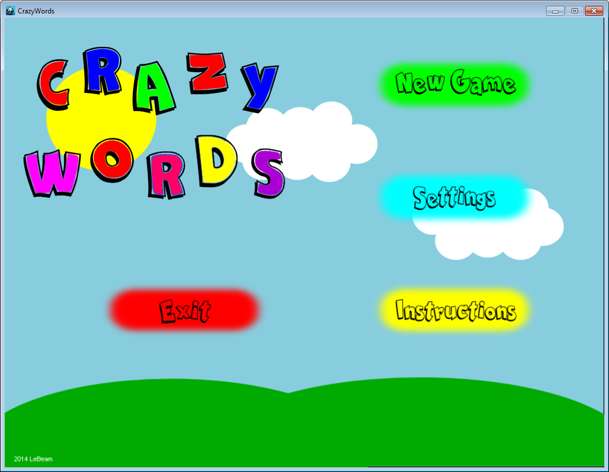
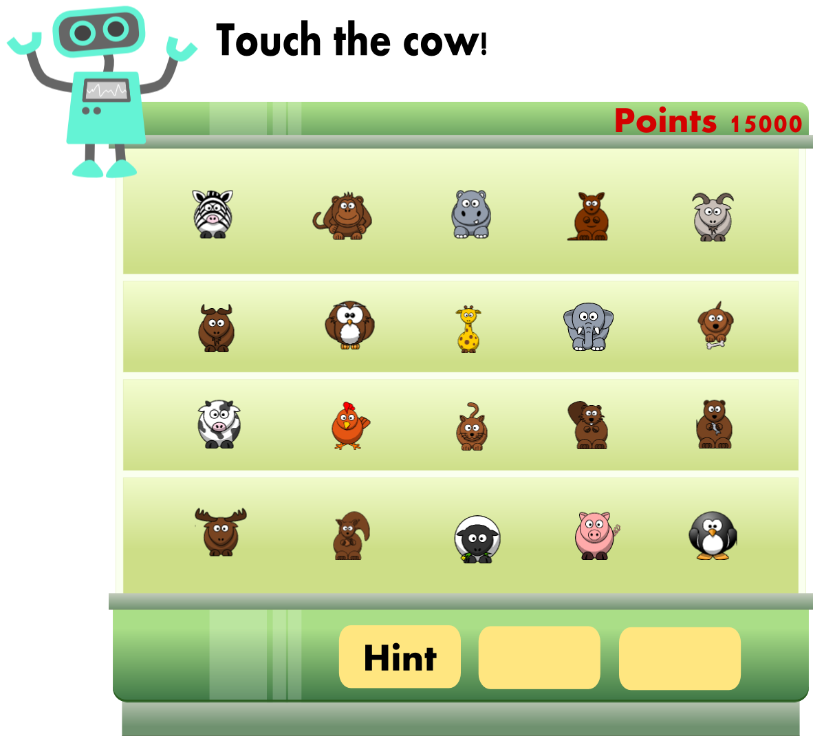

# CrazyWords

¿Sabías que los monos y chimpancés que probaron esta aplicación se divirtieron tanto que no querían devolvernos las tablets? Con **CrazyWords** se divertirán tanto que hasta se olvidarán que están aprendiendo un nuevo idioma.  ¡Así es, van a aprender y jugar como nunca lo habían hecho!

Este juego les ayudará a aprender un nuevo idioma (en este caso inglés), por medio de actividades un poco alocadas que les permitirán aprender desde palabras hasta frases, tal y como si lo estuvieran haciendo en un ambiente nativo de aprendizaje. La idea de este juego es que ustedes participen en actividades un poco inusuales con palabras sencillas que les mostraremos. Luego esas palabras las utilizarán en frases que también estarán fuera de lo común. Cada palabra y frase contará además de su significado y su pronunciación, para que se familiaricen más con el idioma.

++**Nota:**++ Ya nos gustaría que los monos y chimpancés aprendieran idiomas y se divierten tanto como ustedes con esta aplicación.

---

## **Menú tentativo del juego 1**

---

## Ficha técnica

### **Plataformas destino:**
Dado su gran potencial para el manejo táctil, las plataformas que se utilizarán serán ambas para dispositivos móviles, específicamente Android y iOS.

### **Audiencia:**
El juego estará enfocado en niños desde preescolar hasta primaria.

Productos similares

1. **Duolingo:**  Es un juego tanto para dispositivos móviles como para Web. Consiste en aprender una serie de vocabulario al inicio del juego. Luego se aprenden frases con las palabras estudiadas. Si se desconoce alguna palabra que compone la frase se puede pulsar sobre la palabra y aparecerá su traducción. El avanza con respecto a los puntos que vaya ganando durante el juego, así se pueden ir desbloqueando secciones nuevas. Enlace: https://www.duolingo.com

2. **Libro de frases:** Se trata de una aplicación móvil en la que se pueden aprender frases y vocabulario nuevo. Comprende tanto audio para las pronunciaciones de las palabras, la palabra escrita y su transcripción fonética. Cuenta además con la opción de grabar audio para compararlo con la pronunciación real. Enlace: https://play.google.com/store/apps/details?id=com.bravolang.phrasebook

---

## Justificación

Como a los monos y chimpancés les encantó tanto nuestra aplicación decidimos que no íbamos a ser egoístas, por eso la vamos a compartir con ustedes.

Nuestra idea de crear una aplicación para aprender idiomas surge porque pensamos que la comunicación en nuestro mundo actual cada vez va rompiendo barreras geográficas y culturales, por eso no podemos dejar de lado el ámbito linguístico. Aprender otro idioma debería ser divertido porque nos ofrece muchas posibilidades de interacción cultural, por ejemplo podríamos viajar por el mundo, ver series de televisión en otro idioma, e incluso hacer amistades con personas de otros países, y muchas más. Hasta el momento no hemos encontrado una aplicación que nos involucre de forma natural y divertida al aprendizaje de otra lengua. Además cabe destacar que el aprendizaje se facilita mucho en nuestras etapas más tempranas de vida, por eso decidimos que la aplicación iba a estar dirigida a los niños y que aparte de eso iba a ser entretenida, lúdica y creativa. Todo esto se asemeja al ambiente natural en el cual aprendemos nuestro idioma materno. Es por eso que decidmos crear **CrazyWords** en nuestro laboratorio de lenguas, y adivinen qué??? Nuestros monos se contagiaron mientras hacíamos las pruebas.

---

## **Flujo del juego**
Esta aplicación está diseñada para que como usuario aprendas gradualmente, es decir, iniciarás en un nivel de dificultad básico pero poco a poco iremos aumentando esa dificultad hasta llegar a un nivel intermedio o alto. Esto con el fin de que inicies aprendiendo algunas palabras básicas con su significado, su pronunciación y su escritura. Todo eso lo utilizaremos luego para que puedas formar oraciones y las pongas en práctica.

Irás ganando **puntos de aprovechamiento** por nivel, que se pueden interpretar como los conocimientos que has adquirido. ¿Qué quiere decir esto? Que entre mayor sean tus puntos de aprovechamiento (que podrás presumirlos a tus amigos) más has aprendido, esto significa que has aprendido lo que se pretendía y estarás mejor preparado para el siguiente nivel.

Creemos que los juegos deberían ser divertidos, por eso a medida que te incorpores a un nuevo nivel, encontrarás situaciones y retos que harán que demuestres toda tu creatividad y potencial. Cada nivel posee objetos únicos que debes encontrar, mover, tirar, gritarles e incluso comer! [Es importante resaltar que hasta el momento, nadie ha logrado este último...te retamos!]

¿Qué tan seguido alguien te pide que corras hacia la habitación, tomes un zapato y lo tires por la ventana? ¿O que estés tendiendo la ropa, cuando de pronto alguien te grita para que le quites a un mono de la cabeza? ¡¡¡Y en un idioma completamente desconocido por supuesto!! Bueno aquí lo verás mucho, y tendrás que recurrir a todos los medios posibles para poder resolverlos a tiempo!!!

###Nivel 1###

Sabemos por nuestra basta experiencia que una de las mejores maneras de aprender Inglés o un idioma cualquiera, es empezar por conocer palabras simples de uso cotiano, de hecho es así como nosotros fuimos adentrandonos en el habla del Español desde que éramos niños.

Nuestro profesor está muy convencido de esto, por lo que en el primer nivel va a hacer que aprendas 5.000.000 palabras en tan solo 5 minutos! ( Como irás viendo él tiende a exagerar de vez de en cuando, pero eso no le quita lo buen profesor que es). Tal vez no sean 5.000.000 palabras, pero si es cierto que vas a aprender una gran cantidad de palabras mediante la asociación de dibujos, es decir su escritura y tambíen aprenderás su pronunciación ya que, gracias a que algunos de nuestros excelentes asistentes ya graduados se ofrecieron a grabar sus voces pronunciando las diversas palabras, escucharás cómo decir correctamente cada palabra.

Bueno, ¿y cómo lograremos esto? Muy simple, verás aparecer en la pantalla un montón de imágenes seleccioandas sabiamente, las cuales pueden ser de animales, colores, utencilios de cocina, medios de transporte y por qué no fantasmas también. Después de esto nuestro peculiar profesor te indicará, en Inglés obviamente, que selecciones una determinada imagen.
Para hacerlo más intersante, tendrás una cantidad de intentos para obtener una puntuación máxima (establecida según la mejor puntación que obtuvo el profe al realizar las mismas pruebas cuando estabamos en fase beta), y conforme falles la puntuación que obtengas será menor. ¿Que implica esto? Si fallas, no estás comprendiendo la intrucción, por lo tanto te iremos dando pistas a coste de puntos, como por ejemplo escuchar la pronunciación de la palabra, cambiar algúnas palabras o incluso cambiar la instrucción completamente a Español.

Eso de perder puntos no suena muy justo...es por eso que también te premiaremos si logras completar las tareas otorgadas sin fallar múltiples veces entrarás en **racha**. Por algo elegimos a ese profesor en específico, ya que tiene un don increíble para reconocer talento fácilmente, y es por eso que si logras entrar en **racha**, te adelantaremos a un nivel superior, con mayor dificultad. Está mecánica se seguirá utilizando en múltiples partes del juego, por eso te aconsejamos que te acostumbres a ella y aciertes la mayor contidad de tareas para avanzar rápidamente en el juego!

###Nivel 2###
Ya superamos la etapa de realizar tareas sencillas en el laboratorio, por lo que ahora pasaremos a aplicar lo aprendido en el nivel 1, por ejemplo pintar unos objetos y personajes (frutas, títeres, animales y otros más) con colores que él mismo te indicará. Será muy divertido porque de vez en cuando el profesor se vuelve un poco loco y confunde los colores así que será posible que tengas que pintar una jirafa roja o incluso una banana azul, te imaginas???

También tendrás que ayudar en el laboratorio de medios de transporte, como lo dijimos antes el profesor (cuyo nombre no ha sido revelado aún, para ocultar su loquera) es un poco despistado así que te pedirá que le coloques unas alas al barco o que le pongas un periscopio a tu bicicleta, te darás cuenta que este profesor es sumamente divertido.

---

## **Caracteres**
 Para el juego has sido contratado como asistente de un laboratorio de lenguas, en él trabajarás junto con el profesor Lenguín, en los primeros niveles él te podrá ayudar con algunas instrucciones en español, pero luego a medida que vas aprendiendo nuevas cosas te dejará hacer unas cuantas actividades por tu propia cuenta mientras él se ocupa de otras labores, aun así podrás pedirle ayuda de vez en cuando. Más adelante te dejará a cargo del laboratorio porque tiene que viajar a resolver otros problemas en otro laboratorio, en ese momento no podrás pedirle ayuda porque estará muy ocupado, así que deberás resolver todas las actividades en inglés por ti mismo.

 Mientras trabajas en el laboratorio puede ser posible que dejes olvidado algún objeto con el que trabajaste en algún nivel anterior, así que deberás colocarlo en su lugar correspondiente. Por ejemplo si estuvieste trabajando con frutas y estás en el laboratorio de medios de transporte y te aparece una cereza gigante entonces deberás llevarla a su laboratorio correspondiente. Estos objetos especiales te darán puntos extras por tu esfuerzo, orden y cooperación.

---

##**Controles**
El juego lo controlarás por medio del touchscreen de tu dispositivo móvil (tablet o smartphone), utilizando el método de pick and drop. Además podrás utilizar el mouse (ratón) si utilizas la versión para PC, que de igual forma utilizará el método pick and drop.

---

##**Integrantes**
	1. Jonathan Fonseca
	2. Daniel Herrera
	3. Francisco Zúñiga

---
___

**Tabla de Contenidos**

[TOC]

