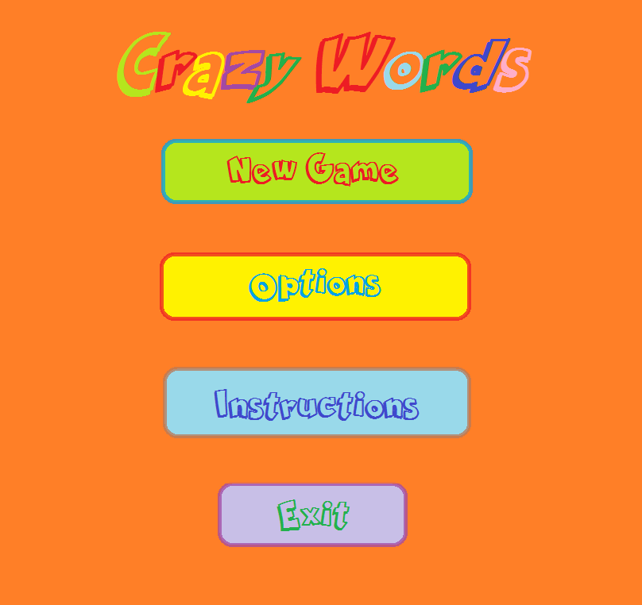

# CrazyWords

![Ide del Juego]](Recursos/imágenes/Idea Juego.jpg)

¿Sabías que los monos y chimpancés que probaron esta aplicación se divirtieron tanto que no querían devolvernos las tablets? Con **CrazyWords** se divertirán tanto que hasta se olvidarán que están aprendiendo un nuevo idioma.  ¡Así es, van a aprender y jugar como nunca lo habían hecho! [Esto no es una descripción del juego, es un método comercial para llamar la atención del lector. No sé hasta qué punto sea adecuado. Suena a que es un juego para monos y que existe una implicación natural de lo que les gusta a los monos le gusta a las personas] 

++Nota:++ Ya nos gustaría ver que de verdad los monos y chimpancés aprenden idiomas y se divierten tanto como ustedes con esta aplicación. 

**Menú tentativo del juego 1:**
[No es necesario utilizar un servidor de imágenes (subeimagenes). Basta con poner la imagen en la misma o una subcarpeta y referenciarla desde el archivo .md. Yo lo hice con el primer menú del juego (ver código de archivo .md)]

**Menú tentativo del juego 2:**

- - -

## Ficha técnica

**Plataformas destino**: Dado su gran potencial para el manejo táctil, las plataformas que se utilizarán serán ambas para dispositivos móviles, específicamente Android y iOS.

**Audiencia**: el juego estará enfocado en niños desde preescolar hasta primaria.

Productos similares

1 Duolingo:  Es un juego tanto para dispositivos móviles como para Web. Consiste en aprender una serie de vocabulario al inicio del juego. Luego se aprenden frases con las palabras estudiadas. Si se desconoce alguna palabra que compone la frase se puede pulsar sobre la palabra y aparecerá su traducción. El avanza con respecto a los puntos que vaya ganando durante el juego, así se pueden ir desbloqueando secciones nuevas. Enlace: https://www.duolingo.com

2 Lista de frases: Se trata de una aplicación móvil en la que se pueden aprender frases y vocabulario nuevo. Comprende tanto audio para las pronunciaciones de las palabras, la palabra escrita y su transcripción fonética. Cuenta además con la opción de grabar audio para compararlo con la pronunciación real.

## Justificación

Como a los monos y chimpancés les encantó tanto nuestra aplicación decidimos que no íbamos a ser egoístas, por eso la vamos a compartir con ustedes. ¿Felices? Pues nosotros sí. Es hora de aprender un nuevo idioma que nos va a facilitar muchas cosas y además nos abrirá muchas puertas. [De nuevo, creo que los monos es algo para hacer reír o entretener, pero no es la justificación completa. Es necesario indicar que es una forma lúdica de aprender otro idioma, como lo hacen los niños en un contexto natural, que es amigable para ellos, o algo así. Bien puede estar dentro o disfrazado de una historia divertida, de monos o cualquier otro medio divertido, pero el mensaje importante no puede faltar]

[Utilizar la estructura del documento correctamente: títulos, párrafos, listas, etc. Arriba hice algunos de estos cambios]

- - -

- **Flujo del juego:** Al inicio el jugador podrá seleccionar el idioma que desea aprender. Una vez seleccionado, el jugador podrá seleccionar de un grupo de catergorías la que más le guste, esto con el fin de que inicie aprendiendo algunas palabras básicas y que serán clave para que pueda avanzar en el juego. Luego de que haya aprendido lo básico entonces estas palabra serán utilizadas en frases que tendrán significados un poco inusuales, como instrucciones que tiene que hacer con el objeto aprendido previamente. El usuario irá ganando **puntos de aprovechamiento** que se pueden interpretar como los conocimientos que ha adquirido.

[Indicar que en cada nivel hay objetos y que el juego solicita encontrar esos objetos o hacer actividades con ellos. Esos objetos son los caracteres del juego. Es válido ser visionarios y decir que el juego puede proveer una situación problemática (ej: se quema algo en la cocina) y el jugador debe hacer algo para resolverla (decirle al personaje que está tendiendo ropa que corra a apagar la cocina), utilizando su voz en el micrófono del dispositivo...]

[Traten de listar en modo general los primeros tres o cinco niveles o mundos del juego]
- - -
- **Caracteres:** El juego se manejará por medio de un usuario, pero también estará presente un host (anfitrión) que será el encargado de ir dando las instrucciones del juego.

- - -

- **Controles:** El juego será controlado por touchscreen del dispositivo móvil (tablet o smartphone), por medio del método de pick and drop en unos casos. Se creará una copia para PC la cual utilizará el ratón como el dedo en una tablet, con el mismo método de pick and drop.

- - -
- **Integrantes:**
	1. Jonathan Fonseca
	2. Daniel Herrera
	3. Francisco Zúñiga
